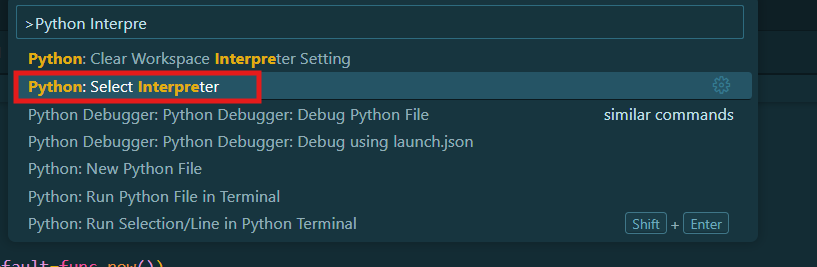
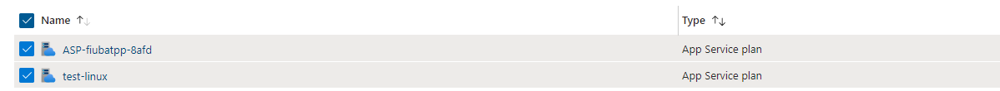
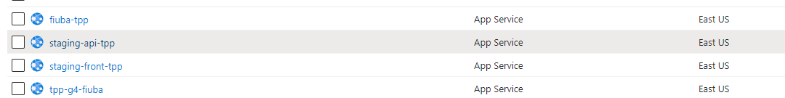
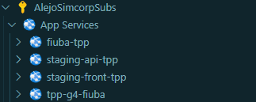
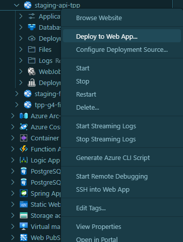

# Assignment Service

[](https://codecov.io/gh/trabajo-profesional-fiuba/assignment-service)

### Enviroments

[Production](https://tpp-g4-fiuba.azurewebsites.net/api/docs)
[Staging](https://staging-api-tpp.azurewebsites.net/api/docs)

> _What problem are we trying to solve?_

The Assignment Management API fue diseñado para optimizar las diferentes asignaciones que se producen 
durante el cuatrimestre de la cursada.

Ademas, a través de sus diferentes endpoints se puede crear cuatrimestres, crear grupos, realizar seguimiento,
enviar notificaciones por mail y mucho mas

Posee tres asignaciones principales

1. Asignacion de estudiantes a grupos incompletos
2. Asignacion de grupos a temas y tutores
3. Asignacion de grupos a fechas de exposicion.

Para realizar estas asignaciones, se utilizan algoritmos de programacion lineal y redes de flujo.

## Collaborators
- Celeste Dituro       - cdituro@fi.uba.ar
- Victoria Abril Lopez - vlopez@fi.uba.ar
- Iván Lautaro Pfaab   - ipfaab@fi.uba.ar
- Alejo Villores       - avillores@fi.uba.ar

# Installation 

Es necesario para este proyecto, tener instalado ``Python 3.11.*`` y ``Poetry (version 1.8.3)`` para un correcto manejo de dependencias y entornos virtuales.

Podes instalar python en el siguiente [link](https://www.python.org/downloads/release/python-3110/)

## Dependencies

Para las dependencias del projecto se utiliza [Poetry](https://python-poetry.org/) . 

Segui las intrucciones para saber si instalaste correctamente la herramienta

```bash
$ poetry --version

Poetry (version 1.8.3)
```
Poetry crea un entorno virtual donde maneja todas las dependencias, esto evita que las instalemos en nuestra computadora y tengamos problemas con las versiones. Debido a que estamos usando un entorno virtual, el interprete de python tiene que ser cambiado para ejecutar comandos de poetry sin invocar poetry

Si estas usando `vscode` como editor de texto, te recomentamos cambiar el interpreter de python


Y seleccionando el python que se encuentra de el entorno virtual de poetry.


De esta manera, ya dentro del entorno virtual podras correr `pytest` en vez de `poetry run pytest`

## Development

A la hora de desarrollar, es necesario mantener una consistencia, para eso hemos realizado unos [code guidelines](https://github.com/trabajo-profesional-fiuba/.github/blob/main/profile/code_guidelines.md) que proponen una 

Es necesario descargar los archivos `.env.development` verificando que este consistente con `.env.example`. Los desarrolladores deberian tener las credenciales

## Docker

Para correr el servicio de backend unsando [Docker](https://docs.docker.com/)

```bash
docker compose -f docker-compose.dev.yml up  --build -d

--build is for build the images (not always necessary)

and 

docker compose -f docker-compose.dev.yml down -v
-v remove volumes (not always necessary)
```

## Run Tests Locally

**Notice:** Tenes que tener instalado `docker` para poder levantar una imagen de PostgresSQL

```bash
# if you want to start a postgres db using Docker
.\InitTestDatabase.ps1

# if you want to stop the db
.\InitTestDatabase.ps1 -StopDatabase
```

> **Asegurate de que el contenedor de PostgreSQL este en funcionamiento de antemano, ya que las pruebas de integracion requieren acceso a la base de datos PostgreSQL.**

```bash
poetry run pytest or just pytest if env is activated.
```

## Format

Para formatear nuestro código, el equipo eligió usar [black](https://black.readthedocs.io/en/stable/index.html). 
Para formatear el código usando Poetry, ejecuta el siguiente comando en tu terminal:

```bash
poetry run black . or just black . if env is activated.
```

## Check format

Para validar que el formato es el esperado
```bash
poetry run flake8 or just flake8 is env is activated.
```

## Database and migrations

Esta seccion se puede encontrar en [Migrations](https://github.com/trabajo-profesional-fiuba/assignment-service/blob/main/alembic/README.md)

## Deploy

Los despiegues de los entornos de `staging` y `prod` se encuentran en [Microsoft Azure](https://portal.azure.com/#home). En el tenemos dos servidores de linux


**ASP-fiubatpp-8afd** Es lo que conocemos como ``prod``.Posee 2 aplicaciones y actualmente corre en un pricing plan de *P0v3*.

**test-linux** Es lo que conocemos como ``staging``.Posee 1 aplicacion y actualmente corre en un pricing plan de *F1*(Free Tier).



### Como deployamos?

Primero en una terminal linux, como puede ser ``Git bash`` corremos el comando 
```bash
sed -i -e 's/\r$//' start_app.sh
```
Esto lo corremos porque si estamos trabajando con Windows, git cambia los LF -> CRLF,

Luego creamos la carpeta de Build ejecutando el ``Powershell``
```cmd
.\MakeDeploymentFolder.ps1 -Enviroment staging|prod
```

Una vez que la carpeta se cree deployamos (Actualmente el proceso es manual por el plan de subscripcion que se tiene). Utilizando el plugin de Azure 


Seleccionamos el App Service correspondiente



Deploy Web App y elegimos la carpeta ``Build``


